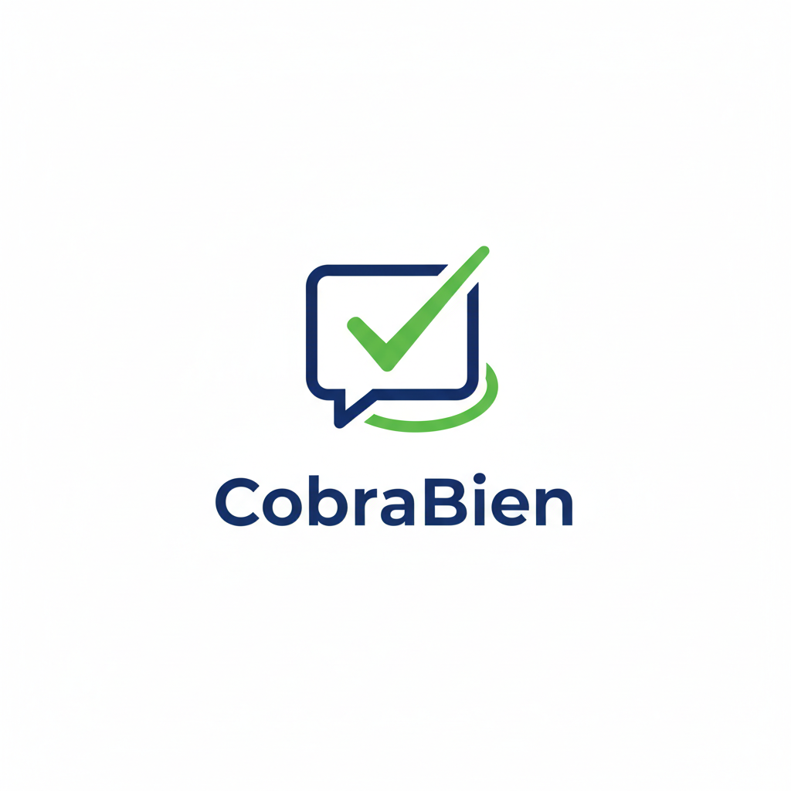

# CobraBien - Herramientas para Cobradores Profesionales

CobraBien es un conjunto de herramientas web gratuitas diseñadas por cobradores, para cobradores. Nuestro objetivo es facilitar la gestión de cobranza en México, con calculadoras rápidas, generadores de mensajes y scripts de llamada.

## 🚀 Características actuales

- **Calculadora de descuento**: Calcula el monto final con descuento y genera mensaje personalizado.
- **Plan con % inicial**: Calcula anticipo y mensualidades basado en un porcentaje.
- **Plan con monto inicial**: Similar al anterior, pero con cantidad fija.
- **Confirmación de acuerdo**: Genera mensaje de confirmación de pago.
- **Recordatorio de pago**: Mensaje recordatorio para vencimientos.
- **Script de llamada**: Guion completo para asesores telefónicos.
- **Generador de mensajes Email/WhatsApp**: (NUEVO) Crea mensajes personalizados masivos desde archivos Excel.

## 🛠️ Tecnologías

- HTML5, CSS3, JavaScript (ES6)
- SheetJS para lectura de Excel
- GitHub Pages para hosting

## 📖 Cómo usar

1. Visita [cobrabien.github.io](https://cobrabien.github.io)
2. Elige la herramienta que necesitas.
3. Ingresa los datos solicitados.
4. Genera, copia y pega en tu canal de comunicación.

Para el generador de mensajes:
- Define las columnas de tu Excel (correo, nombre, etc.)
- Redacta una plantilla con `{{variable}}`
- Sube tu archivo (máx. 1000 filas)
- Navega entre filas y copia mensajes individualmente o todos los resúmenes.

## 🤝 Contribuir

¿Tienes ideas para nuevas herramientas? ¿Encontraste un bug? Envíanos un mensaje por WhatsApp (ver footer) o abre un issue en GitHub.

## 📌 Roadmap

Consulta [ROADMAP.md](ROADMAP.md) para conocer los planes futuros.

## 📄 Licencia

Este proyecto es de código abierto bajo la licencia MIT. Si te sirve, ¡compártelo!
